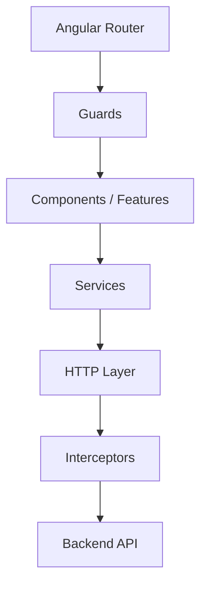

# Tarea: Documentar los componentes y elementos principales de Angular utilizados en Climate_Frontend

Analiza completamente el repositorio actual de Angular:

`Climate_Frontend`

Repositorio de referencia:

`https://github.com/CinthiaR13986/Climate_Frontend`

La rama principal actual es:

`master`

## Objetivo

Necesito generar documentación técnica y académica del frontend Angular existente.

Debes inspeccionar el código fuente real del proyecto y generar dos archivos con el mismo contenido:

1. `Documentacion_Componentes_Angular.md`
2. `Documentacion_Componentes_Angular.docx`

El documento debe explicar las principales categorías o elementos de Angular utilizados en el proyecto y, dentro de cada categoría, enumerar todos los elementos concretos que existen actualmente en el código.

NO debes limitarte únicamente a los archivos dentro de `core`.

Debes analizar recursivamente como mínimo:

```text
src/
└── app/
    ├── core/
    ├── features/
    ├── shared/
    ├── app.config.ts
    ├── app.routes.ts
    └── app.ts
```

También puedes analizar otros archivos del proyecto cuando ayuden a entender la arquitectura.

---

# 1. Regla fundamental

Toda la documentación debe estar basada en el código REAL existente.

No inventes:

- Components
- Services
- Guards
- Interceptors
- Pipes
- Directives
- Models
- Interfaces
- Routes
- Resolvers
- Stores
- Signals
- Helpers
- Utilities
- Validators
- Providers

Si una categoría no existe en el proyecto, puedes indicarlo expresamente:

> No se identificaron elementos de esta categoría en la versión actual del proyecto.

No crees código nuevo.

No refactorices.

No cambies la arquitectura.

Esta tarea es únicamente de análisis y documentación.

---

# 2. Estructura general del documento

El documento debe tener la siguiente estructura.

# Documentación de Componentes Angular
## Climate Monitoring System

### 1. Introducción

Explicar brevemente:

- qué es Angular;
- qué función cumple Angular dentro de este proyecto;
- que el proyecto corresponde al frontend del Climate Monitoring System;
- que la aplicación está organizada principalmente mediante `core`, `features` y `shared`;
- que se utiliza una arquitectura Angular moderna;
- explicar brevemente la separación de responsabilidades entre estas carpetas.

---

# 3. Resumen de arquitectura

Generar una representación de la estructura relevante del proyecto.

Ejemplo:

```text
src/app
├── core
│   ├── auth
│   ├── config
│   ├── guards
│   ├── http
│   ├── interceptors
│   ├── layout
│   ├── notifications
│   └── realtime
├── features
├── shared
├── app.config.ts
├── app.routes.ts
└── app.ts
```

Este árbol debe ser generado a partir de la estructura REAL del repositorio.

Si existen más directorios o elementos importantes, agregarlos.

---

# 4. Categorías Angular

Para cada categoría encontrada, primero debes proporcionar una explicación GENERAL del concepto de Angular y posteriormente documentar las implementaciones concretas existentes en Climate_Frontend.

Utilizar este patrón:

# Guards

## ¿Qué es un Guard?

Explicar de manera sencilla qué es un Guard en Angular.

Por ejemplo:

Los Guards permiten controlar si un usuario puede acceder o no a determinadas rutas de una aplicación. Se suelen utilizar para validar autenticación, autorización, roles o condiciones específicas antes de permitir la navegación.

## Guards utilizados en Climate_Frontend

### AuthGuard

**Ubicación:**

```text
src/app/core/guards/...
```

**Tipo:**

```text
Guard de autenticación
```

**Descripción:**

Explicar qué hace específicamente este Guard leyendo su implementación.

**Utilidad dentro del proyecto:**

Explicar por qué existe dentro de Climate Monitoring System.

Por ejemplo:

> Evita que usuarios no autenticados puedan acceder a las vistas protegidas del sistema.

**Dependencias principales:**

Enumerar únicamente las dependencias relevantes identificadas en el código.

Ejemplo:

```text
- AuthService
- Router
```

**Dónde se utiliza:**

Indicar las rutas, componentes u otros archivos donde se encuentre utilizado.

Ejemplo:

```text
src/app/app.routes.ts
```

---

# 5. Categorías que debes buscar

Analiza TODO el proyecto y busca, como mínimo, las siguientes categorías.

## 5.1 Components

Explicar qué es un Component en Angular.

Después listar TODOS los componentes existentes.

Para cada componente indicar:

- Nombre
- Ruta
- Selector, cuando exista
- Tipo
- Descripción
- Responsabilidad
- Dependencias principales
- Servicios consumidos
- Inputs, si existen
- Outputs, si existen
- Signals, si existen
- Ruta asociada, si existe
- Componentes relacionados

Ejemplo:

```text
DashboardComponent

Ubicación:
src/app/features/dashboard/...

Descripción:
Representa la pantalla principal del sistema...

Utilidad:
Permite visualizar...
```

---

# 5.2 Services

Explicar qué es un Service.

Después listar todos los servicios reales del proyecto.

Por cada Service indicar:

- Nombre
- Ruta
- Responsabilidad
- Métodos principales
- Dependencias
- API o endpoint consumido, cuando aplique
- Componentes que utilizan el servicio

Evita documentar todos los métodos línea por línea.

Resume solamente los métodos relevantes.

---

# 5.3 Guards

Explicar qué es un Guard.

Después listar todos los Guards existentes.

Indicar:

- Nombre
- Ruta
- Tipo de validación
- Dependencias
- Qué condición valida
- Qué sucede cuando la validación es correcta
- Qué sucede cuando falla
- Rutas donde se utiliza

---

# 5.4 Interceptors

Explicar qué es un HTTP Interceptor.

Después listar todos los interceptores existentes.

Por cada uno indicar:

- Nombre
- Ruta
- Responsabilidad
- Qué modifica de la petición o respuesta
- Dependencias
- Casos en los que actúa

Por ejemplo:

- agregar JWT;
- capturar errores;
- modificar headers;
- manejar respuestas HTTP.

Solo mencionar aquello que realmente haga el código.

---

# 5.5 Routing

Explicar qué es Angular Router.

Analizar:

```text
src/app/app.routes.ts
```

y cualquier archivo adicional de rutas.

Documentar:

- rutas principales;
- rutas hijas;
- lazy loading;
- Guards asociados;
- componentes cargados;
- redirecciones;
- rutas protegidas;
- rutas públicas.

Generar una tabla:

| Ruta | Componente / Feature | Guard | Tipo | Descripción |
|---|---|---|---|---|

---

# 5.6 Authentication

Analizar especialmente:

```text
src/app/core/auth
```

Explicar de forma general qué representa la capa de autenticación.

Después identificar todas sus clases, servicios, modelos o utilidades.

Por cada elemento indicar:

- nombre;
- ruta;
- propósito;
- relación con JWT o autenticación;
- componentes que lo utilizan.

---

# 5.7 HTTP

Analizar:

```text
src/app/core/http
```

Explicar cómo Angular consume APIs mediante HttpClient.

Posteriormente documentar las implementaciones concretas del proyecto.

Incluir, cuando corresponda:

- clientes HTTP;
- wrappers;
- servicios base;
- tipos de respuesta;
- manejo de errores;
- configuración de URLs.

---

# 5.8 Configuration

Analizar:

```text
src/app/core/config
```

y:

```text
src/app/app.config.ts
```

Explicar:

- configuración global;
- providers;
- configuración HTTP;
- configuración de Router;
- variables de entorno;
- configuración relacionada con APIs.

No revelar secretos si accidentalmente existieran credenciales en archivos de configuración.

---

# 5.9 Layout

Analizar:

```text
src/app/core/layout
```

Explicar primero qué representa un Layout en una aplicación Angular.

Después documentar elementos como:

- Header
- Navbar
- Sidebar
- Footer
- Main Layout
- Shell

únicamente si realmente existen.

Para cada uno indicar:

- ubicación;
- responsabilidad;
- componentes hijos;
- navegación relacionada;
- servicios utilizados.

---

# 5.10 Features

Analizar recursivamente:

```text
src/app/features
```

Cada subcarpeta debe considerarse una funcionalidad o módulo funcional del sistema.

Ejemplos posibles:

```text
dashboard
monitoring
sensors
communities
alerts
events
users
audit
```

No asumir que existen: verificarlo.

Para cada Feature generar:

# Nombre de Feature

**Ruta:**

```text
src/app/features/...
```

**Objetivo funcional:**

Descripción.

**Componentes:**

Listado.

**Servicios:**

Listado.

**Modelos/interfaces:**

Listado.

**Rutas:**

Listado.

**Dependencias relevantes:**

Listado.

---

# 5.11 Shared

Analizar:

```text
src/app/shared
```

Explicar qué significa `shared` dentro de una arquitectura Angular.

Después clasificar todos los elementos encontrados.

Ejemplo:

- componentes reutilizables;
- pipes;
- directives;
- interfaces;
- helpers;
- validators;
- utilidades.

---

# 5.12 Models e Interfaces

Buscar:

```typescript
interface
type
class
enum
```

que sean utilizados como modelos del dominio o DTO.

Agruparlos de forma razonable.

Para cada uno indicar:

- Nombre
- Ruta
- Tipo
- Propósito
- Dónde se utiliza

No es necesario copiar todas sus propiedades salvo que sea útil para comprenderlo.

---

# 5.13 Pipes

Explicar qué es un Pipe.

Después listar Pipes personalizados existentes.

Indicar:

- nombre;
- ruta;
- entrada;
- salida;
- propósito.

Si no existen, indicar:

> No se identificaron Pipes personalizados en el proyecto.

---

# 5.14 Directives

Explicar qué es una Directive.

Después listar Directives personalizadas existentes.

Si no existen, indicarlo.

---

# 5.15 Signals

Analizar el uso de:

```typescript
signal()
computed()
effect()
```

y APIs relacionadas con Signals.

Explicar primero qué son los Signals en Angular moderno.

Después indicar dónde se utilizan dentro del proyecto y con qué propósito.

Ejemplo:

```text
UserService

Signal:
currentUser

Utilidad:
Mantiene de forma reactiva la información del usuario autenticado.
```

No asumir que el proyecto utiliza Signals: comprobarlo.

---

# 5.16 Observables y RxJS

Explicar brevemente:

- Observable;
- Subject;
- BehaviorSubject;
- pipe;
- operadores RxJS.

Después identificar los usos relevantes encontrados.

No documentar cada `subscribe()` individual.

Agrupar por responsabilidad.

---

# 5.17 Forms

Buscar:

```text
ReactiveFormsModule
FormsModule
FormGroup
FormControl
FormBuilder
Validators
```

Explicar brevemente Reactive Forms y Template-driven Forms.

Después documentar los formularios relevantes del proyecto.

Por cada formulario indicar:

- componente;
- tipo de formulario;
- propósito;
- validaciones principales.

---

# 5.18 Validators

Buscar Validators estándar y personalizados.

Para Validators personalizados indicar:

- Nombre
- Ruta
- Regla que valida
- Formularios donde se utiliza

---

# 5.19 Notifications

Analizar:

```text
src/app/core/notifications
```

Explicar el mecanismo utilizado por el proyecto para mostrar mensajes o notificaciones.

Documentar cada implementación encontrada.

---

# 5.20 Realtime

Analizar:

```text
src/app/core/realtime
```

Determinar si utiliza:

- SignalR;
- WebSockets;
- SSE;
- polling;
- otro mecanismo.

Explicar exclusivamente el mecanismo real utilizado.

Indicar:

- servicio;
- ruta;
- conexión;
- eventos recibidos;
- componentes consumidores.

---

# 6. Elementos adicionales

Si durante el análisis encuentras otros conceptos relevantes que no aparecen en la lista anterior, debes crear automáticamente nuevas categorías.

Por ejemplo:

- Resolvers
- Stores
- State Management
- DTOs
- Enums
- Helpers
- Utility classes
- Mappers
- Constants
- Injection Tokens
- Providers
- Error handlers
- Base classes

No excluirlos simplemente porque no aparecen explícitamente en estas instrucciones.

---

# 7. Formato estándar por elemento

Siempre que sea posible, documentar cada elemento utilizando:

## NombreElemento

**Categoría:**  
Service / Component / Guard / Interceptor / etc.

**Ubicación:**

```text
src/app/...
```

**Descripción:**

Explicación sencilla de su responsabilidad.

**Utilidad dentro del proyecto:**

Explicar qué problema resuelve específicamente en Climate Monitoring System.

**Dependencias principales:**

```text
- Dependencia 1
- Dependencia 2
```

**Utilizado por:**

```text
- Componente / Servicio / Ruta
```

**Observaciones:**

Solo agregar esta sección cuando exista información importante.

---

# 8. Ejemplo esperado

## Guards

Los Guards son mecanismos proporcionados por Angular Router que permiten decidir si una navegación puede continuar. Son utilizados principalmente para autenticación, autorización y validación de condiciones antes de mostrar una vista.

### AuthGuard

**Ubicación:**

```text
src/app/core/guards/auth.guard.ts
```

**Descripción:**

Valida si existe una sesión válida antes de permitir el acceso a una ruta protegida.

**Utilidad dentro del proyecto:**

Evita que usuarios no autenticados puedan ingresar a funcionalidades privadas del Climate Monitoring System.

**Utilizado en:**

```text
src/app/app.routes.ts
```

IMPORTANTE:

Este ejemplo solamente representa el FORMATO.

Debes leer el código real antes de afirmar que `AuthGuard`, esa ruta o ese comportamiento existen exactamente de esa manera.

---

# 9. Tabla general de inventario

Al final del documento generar una tabla consolidada:

| Categoría | Nombre | Ruta | Responsabilidad |
|---|---|---|---|
| Component | ... | ... | ... |
| Service | ... | ... | ... |
| Guard | ... | ... | ... |
| Interceptor | ... | ... | ... |

La tabla debe incluir TODOS los elementos relevantes identificados.

---

# 10. Resumen cuantitativo

Generar una sección:

# Resumen de elementos encontrados

Ejemplo:

| Tipo | Cantidad |
|---|---:|
| Components | 15 |
| Services | 8 |
| Guards | 2 |
| Interceptors | 2 |
| Pipes | 1 |
| Directives | 0 |
| Features | 7 |

Los valores deben calcularse del repositorio real.

---

# 11. Mapa conceptual de arquitectura

Generar un diagrama Mermaid mostrando de forma simplificada cómo interactúan las capas.

Ejemplo:



Modificarlo según la arquitectura REAL encontrada.

---

# 12. Flujo general de una petición

Si la arquitectura del proyecto lo permite, documentar un flujo como:

```text
Usuario
  ↓
Component
  ↓
Service
  ↓
HttpClient
  ↓
Interceptor
  ↓
Backend API
  ↓
Response
  ↓
Service
  ↓
Component
  ↓
Vista
```

Adaptarlo a la implementación real.

---

# 13. Análisis de relaciones

Para los elementos importantes identificar relaciones reales.

Ejemplo:

```text
LoginComponent
    ↓
AuthService
    ↓
HttpClient
    ↓
AuthInterceptor
    ↓
Backend
```

También documentar relaciones como:

```text
Router
    ↓
AuthGuard
    ↓
AuthService
```

Solamente incluir relaciones verificadas en imports, inyección de dependencias, rutas o llamadas.

---

# 14. Nivel de explicación

El documento está dirigido a estudiantes universitarios que están aprendiendo Angular.

Por ello:

- utilizar lenguaje técnico pero comprensible;
- explicar primero el concepto general;
- después explicar cómo se utiliza en el proyecto;
- evitar definiciones excesivamente académicas;
- no asumir conocimiento avanzado de Angular;
- explicar siglas la primera vez que aparezcan.

Por ejemplo:

> HTTP Interceptor: mecanismo que permite interceptar una solicitud HTTP antes de enviarla al servidor o procesar su respuesta antes de entregarla al servicio que realizó la solicitud.

---

# 15. No confundir conceptos

Es importante distinguir entre:

```text
Angular Component
Angular Service
Angular Guard
Angular Interceptor
Angular Directive
Angular Pipe
Model / Interface
Feature
Layout
Helper / Utility
```

No denominar "componente" genéricamente a todo.

Sin embargo, el título del documento puede utilizar "Componentes Angular" en un sentido arquitectónico general.

---

# 16. Inspección requerida

Antes de generar la documentación:

1. Recorrer recursivamente `src/app`.
2. Identificar todos los `.ts`.
3. Revisar imports.
4. Revisar decoradores Angular.
5. Revisar `app.routes.ts`.
6. Revisar `app.config.ts`.
7. Revisar todos los Services.
8. Revisar Guards.
9. Revisar Interceptors.
10. Revisar Components.
11. Revisar Features.
12. Revisar `shared`.
13. Revisar modelos/interfaces/enums.
14. Revisar Signals.
15. Revisar RxJS.
16. Revisar Forms.
17. Revisar configuración HTTP.
18. Revisar realtime.
19. Identificar dónde es consumido cada elemento importante.

No documentar un archivo basándose únicamente en su nombre.

Leer su contenido.

---

# 17. Validación de referencias

Para determinar qué utiliza cada elemento:

buscar imports como:

```typescript
import { ... }
```

inyecciones como:

```typescript
inject(...)
```

o constructor injection:

```typescript
constructor(...)
```

también revisar:

```typescript
providers
canActivate
canMatch
loadComponent
loadChildren
component
children
```

y cualquier otro mecanismo Angular utilizado.

---

# 18. Archivos de salida

Generar:

```text
docs/angular-components/
├── Documentacion_Componentes_Angular.md
└── Documentacion_Componentes_Angular.docx
```

Crear el directorio si no existe.

---

# 19. Documento Markdown

`Documentacion_Componentes_Angular.md` debe utilizar:

- `#` para títulos;
- `##` para categorías;
- `###` para implementaciones;
- tablas Markdown;
- bloques de código para rutas;
- Mermaid para diagramas.

Debe poder visualizarse correctamente desde GitHub.

---

# 20. Documento Word

Generar:

```text
Documentacion_Componentes_Angular.docx
```

con presentación académica y profesional.

Debe contener:

- portada;
- título;
- subtítulos;
- índice;
- numeración de secciones;
- tablas;
- rutas de archivos con fuente monoespaciada;
- diagramas;
- encabezados claramente diferenciados;
- numeración de páginas.

Título:

**Documentación de Componentes Angular**

Subtítulo:

**Climate Monitoring System**

Repositorio:

**Climate_Frontend**

---

# 21. Consistencia entre documentos

El `.md` y el `.docx` deben contener esencialmente la misma información.

No generar un Word resumido.

No generar un Markdown resumido.

Ambos son entregables completos.

---

# 22. Control de calidad

Antes de finalizar realiza una segunda revisión automática.

Verifica:

- que ningún Component haya quedado fuera;
- que ningún Service haya quedado fuera;
- que ningún Guard haya quedado fuera;
- que ningún Interceptor haya quedado fuera;
- que las rutas de archivos sean correctas;
- que los nombres de clases coincidan con el código;
- que las descripciones correspondan a la implementación;
- que no se documenten elementos eliminados;
- que no se confundan archivos de prueba con implementaciones;
- que no se inventen responsabilidades basándose únicamente en el nombre.

---

# 23. Archivos de pruebas

Los archivos:

```text
*.spec.ts
```

pueden revisarse para comprender el comportamiento de una clase, pero NO deben contabilizarse como Components, Services o elementos independientes.

---

# 24. Archivos históricos o documentación previa

El repositorio contiene documentación previa bajo:

```text
docs/
```

Puedes utilizarla únicamente como contexto secundario.

La fuente principal de verdad debe ser:

```text
src/
```

Si la documentación antigua contradice al código actual, utilizar el código actual.

---

# 25. Resultado esperado

Al terminar deben existir:

```text
docs/angular-components/Documentacion_Componentes_Angular.md
docs/angular-components/Documentacion_Componentes_Angular.docx
```

y debes mostrar en consola un resumen similar a:

```text
Documentación Angular generada correctamente.

Components encontrados: X
Services encontrados: X
Guards encontrados: X
Interceptors encontrados: X
Features encontradas: X
Pipes encontrados: X
Directives encontradas: X
Models/Interfaces encontrados: X

Archivos generados:
- docs/angular-components/Documentacion_Componentes_Angular.md
- docs/angular-components/Documentacion_Componentes_Angular.docx
```

Los valores `X` deben calcularse dinámicamente a partir del análisis realizado.

---

# 26. Restricciones finales

NO modificar el código funcional del frontend.

NO modificar APIs.

NO modificar componentes.

NO modificar rutas.

NO modificar servicios.

NO corregir errores aunque los encuentres.

NO hacer refactor.

NO instalar librerías innecesarias.

Solamente se permite agregar las herramientas estrictamente necesarias para crear el `.docx` si el entorno no dispone de ellas.

El objetivo es:

**analizar → clasificar → explicar → documentar.**